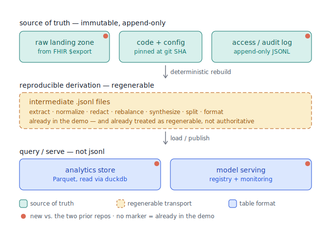

# Project: Clinical Data Pipeline — Production-True (build spec)

Third companion repo in the clinical-data-pipeline portfolio arc:

- `../clin-data-pipeline` — the original: demonstrates the **domain** (FHIR
  generation → LLM extraction → curation → split/format → LoRA fine-tune)
  end to end on synthetic data.
- `../clin-data-pipeline-scale` — the companion: demonstrates **running the
  LLM-calling parts at volume** (bounded concurrency, retry/backoff,
  crash-safe caching, a Batches API mode, structured data-quality metrics),
  with a Tier 1 (build-for-real) / Tier 2 (document-honestly) split.
- **This repo** — demonstrates the **production-true patterns** the first
  two deliberately stubbed: the governance spine (de-identification, BAAs,
  audit), orchestration, data/model versioning and lineage, data-quality
  gates, and a real serving/analytics layer — built where credible on
  synthetic data, documented honestly where a real deployment is the only
  place they can exist.

Same working conventions as the other two: **honesty over polish** (no
invented benchmarks, no "leveraged advanced techniques" language), **explain
trade-offs rather than just picking one**, **fully synthetic data only**, and
**build incrementally, one verified step at a time**.

## The organizing principle: source of truth vs. reproducible derivation

The single fact that reshapes this repo relative to the other two: once the
data is real it is **PHI**, and the governance around the ML — not the ML
itself — becomes the spine. Everything else follows from one design rule:

> The only authoritative things are (a) the **immutable raw input** and
> (b) the **code + config** that transforms it. Every intermediate artifact
> is a **reproducible derivation** — regenerable, idempotent, versioned —
> and must never itself become a source of truth. If an intermediate can't
> be regenerated from raw + pinned code, lineage is already lost.

This is why the question "is JSONL ever a source of truth?" has a precise
answer, mapped by pipeline role below:

- **JSONL/NDJSON *is* authoritative** in exactly two roles: the **immutable
  raw landing layer** (FHIR Bulk Data `$export` emits NDJSON, kept
  immutably as "exactly what the source sent at time T") and **append-only
  access/audit logs**. Immutability is the whole point in both.
- **JSONL is fine but *not* authoritative** as inter-stage transport — the
  regenerable derivation files. The demo pipeline already sits here and
  already treats these as regenerable (it does full deterministic rebuilds),
  which is the correct property.
- **JSONL is the wrong tool** for anything queried or mutated — the
  serve/analytics layer needs columnar reads and schema enforcement, i.e. a
  table format. This repo builds that for real as **Parquet, queried
  in-process via `duckdb`** (no server, no Spark) — something neither prior
  repo had (they used a flat CSV feature table). **Delta Lake / Iceberg**
  (the transactional layer adding ACID + concurrent-writer safety +
  time-travel) is the further production upgrade, documented but not built
  here — it only pays for itself with multiple concurrent writers, which a
  single-pipeline portfolio repo doesn't have.

The coral dots in the diagram mark what's new relative to the two prior
repos — none of these exist in either one: the **immutable raw landing
layer**, the **access/audit log**, the **Parquet analytics store**, and
**model-registry-backed serving with monitoring**.

## Pipeline stages

### Stage 0 — Ingestion / interchange
- Consume **FHIR R4 (4.0.1)** via **Bulk Data Access (`$export`)**, which
  emits **NDJSON** (one resource per line). Legacy paths: **HL7 v2** feeds,
  **C-CDA** (XML) documents.
- Batch `$export` for bulk; **FHIR Subscriptions** for near-real-time.
  Idempotent and incremental (`_since`), so re-runs process only new/changed
  resources.
- The raw NDJSON is written **once, immutably** to the landing layer — the
  authoritative record everything downstream regenerates from.

### Stage 1 — Canonical storage + terminology binding
- Store **FHIR R4 constrained to US Core** profiles (US-realm baseline).
  Model resources properly — e.g. blood pressure is **one Observation
  (LOINC 85354-9) with `component` entries** for systolic (8480-6) and
  diastolic (8462-4), not a flat single value (a simplification both prior
  repos made and documented).
- Bind coded fields to real terminologies: **SNOMED CT** (problems),
  **ICD-10-CM** (billing dx), **LOINC** (labs/vitals), **RxNorm** (meds),
  **UCUM** (units). The demo's closed-vocabulary lookup tables become
  **terminology-service** calls or a pinned value-set snapshot.
- Validate conformance with the **HL7 FHIR Validator** / `$validate` (Inferno
  for US Core).

### Stage 2 — De-identification + governance (the biggest addition)
- Legal frame: **HIPAA §164.514** — **Safe Harbor** (strip all 18
  identifiers; dates collapse to year, ages >89 aggregated) or **Expert
  Determination**. Shifted-but-preserved dates survive only under a
  **Limited Data Set + Data Use Agreement**, *not* Safe Harbor.
- Keep the demo's **per-entity, interval-preserving date-shift** (diagnosis→
  treatment gaps intact) — it is exactly the LDS pattern; just situate it
  legally.
- Free-text de-id (the demo's known-string find-and-replace does **not**
  generalize to real notes): use **NLP de-id** (Presidio / Philter / NLM
  Scrubber / Comprehend Medical) with a **human QA sample** and a measured
  recall target, since missed PHI is a breach.
- **BAA** with any vendor before PHI touches it — cloud *and* the LLM API.

### Stage 3 — LLM extraction
- Ordering decision: de-identify notes **before** extraction (de-id keeps
  clinical content, so a de-identified note can go to a BAA-covered external
  model), **or self-host** the extraction model inside the compliance
  boundary (**vLLM** / **TGI**) when de-id can't be trusted enough. Both are
  legitimate; document the choice.
- Carry forward the demo's **constrained/tool-use structured output**,
  **cache-first**, and **Batches API** bulk mode. Add **confidence scoring +
  human-in-the-loop review** for low-confidence outputs, and **provenance**
  (which model + prompt version produced each field).

### Stage 4 — Curation / normalization / validation
- The demo's normalize/redact/rebalance/synthesize maps directly here.
  Production addition: **declarative data-quality tests as a gate**
  (**Great Expectations** or **Pandera**) — completeness, referential
  integrity, value ranges — that **fail the pipeline**, not just print a
  metric.

### Stage 5 — Dataset assembly
- Train/val/test in **JSONL** (the de facto fine-tuning format). The demo's
  **group-aware, leakage-safe splitting** is already production-correct —
  keep it verbatim. Add a frozen, versioned **held-out gold set** for eval.

### Stage 6 — Training + model lifecycle
- Keep the demo's real LoRA run. Add **experiment tracking** (MLflow / W&B),
  a **model registry** with versioning, and **data↔model lineage** (a model
  traces back to the exact data snapshot and git SHA).

### Stage 7 — Evaluation + release
- Release gate on the frozen gold set: per-field precision/recall,
  **hallucination checks** (the demo's non-canonical tracking), and
  **raw per-example outputs persisted** for auditability. Ship a **model
  card** documenting scope and limits (the demo's "honest framing" note is a
  proto model card).

### Cross-cutting
- **Orchestration**: Airflow / Dagster / Prefect (the scale repo's Tier 2
  list — here they're built).
- **Storage**: a real **Parquet analytics table**, queried via **duckdb**
  (no server) — neither prior repo had this, only a flat CSV feature table.
  **Delta Lake / Iceberg** (ACID, concurrent writers, time-travel) is
  documented as the upgrade for a real multi-writer lakehouse, not built.
- **Versioning**: **DVC** or **lakeFS** for data + model snapshots.
- **Lineage/provenance** end to end; **drift monitoring** (Evidently) in
  serving; **CI/CD** with the DQ + eval gates wired in.

## Standards / features checklist

| Concern | Standard / feature |
|---|---|
| Interchange | FHIR R4 + US Core; HL7 v2; C-CDA; **NDJSON** (Bulk Data) |
| Terminologies | SNOMED CT, ICD-10-CM, LOINC, RxNorm, UCUM |
| Vitals modeling | FHIR vital-signs profile (BP as panel + components) |
| Analytics model | OMOP CDM (optional, for research) |
| De-identification | HIPAA Safe Harbor **or** Expert Determination; **LDS + DUA** for shifted dates |
| Date handling | Per-entity consistent shift, interval-preserving |
| Free-text PHI | NLP de-id (Presidio/Philter) + human QA |
| Vendor access | **BAA** before any PHI; or self-hosted model |
| Data quality | Great Expectations / Pandera as pipeline gates |
| Orchestration | Airflow / Dagster / Prefect |
| Storage/format | Parquet, queried via duckdb (**built**); Delta/Iceberg (**documented upgrade**) |
| Dataset format | JSONL, group-aware leakage-safe splits |
| ML lifecycle | MLflow / W&B, model registry, model cards |
| Versioning/lineage | DVC / lakeFS, end-to-end provenance |
| Run/lineage log | Provenance table (stage, timestamp, in→out hashes, counts, model + git SHA) — **Tier 1, displayed** |
| Access/audit log | HIPAA access logging — **Tier 2, documented explainer (not fabricated)** |
| Serving | vLLM / TGI, drift monitoring, CI/CD gates |

## What already exists vs. what this repo adds

**Already production-aligned in the demo** (so this repo is additive, not a
rewrite): FHIR-as-source-of-truth, per-category interval-preserving date
shifts, group-aware leakage-safe splitting, cache-first + Batches
extraction, honest eval with hallucination tracking, deterministic seeded
rebuilds, and treating intermediate JSONL as regenerable rather than
authoritative.

**The genuine additions** (coral dots in the diagram — new vs. both prior
repos): an **immutable raw landing layer** fed by real `$export`, an
**access/audit log** (Tier 2 — documented only; see below), a **pipeline
run/lineage log** (Tier 1 — real, displayed), a real **Parquet analytics
store queried via duckdb** (Tier 1 — built; Delta/Iceberg documented, not
built), **de-identification-at-scale + BAA governance**, **DQ gates**,
**orchestration**, **data/model versioning + lineage**, and
**model-registry-backed serving** with drift monitoring.

> **Two things get called "event/audit log" — keep them apart:**
> - **Access/audit log** (the immutable source-of-truth box in the diagram):
>   records real access/ingestion events ("who read record X, when"). On
>   synthetic data there are no genuine access events, so this stays **Tier 2
>   — a documented explainer in the app, never a fabricated feed.** Inventing
>   audit entries would break the project's no-invented-data rule.
> - **Pipeline run/lineage log**: a record of each stage actually running —
>   timestamp, input→output hashes, record counts, model version + git SHA.
>   This is **honest data (it really happened)**, so it's **Tier 1 — a real
>   committed artifact the app displays** as a provenance table.

## Tiering (same discipline as the scale repo)

- **Tier 1 — build for real on synthetic data**: NDJSON immutable landing +
  reproducible-derivation discipline, FHIR/US Core modeling with real
  terminology binding, NLP-based free-text de-id (with measured recall),
  DQ gates, group-aware splits, experiment tracking + model registry +
  model card, a real **Parquet analytics table queried via duckdb**, and the
  **pipeline run/lineage log** (real run history, displayed in the app).
  Each ships with a real, committed artifact — no claimed capability
  without a run behind it.
- **Tier 2 — document honestly, don't fake**: anything whose value only
  exists in a real deployment — a signed BAA, a production `$export` feed
  from a live EHR, PHI at real volume, a full orchestration cluster, a real
  **Delta/Iceberg lakehouse** (ACID + concurrent multi-writer guarantees —
  meaningful only at real multi-writer scale, not a single pipeline), and
  the **access/audit log** (real access events need real users/PHI; the app
  shows a documented explainer, not a fabricated feed). These get an in-repo
  write-up of what they'd be and why they can't be demonstrated on synthetic
  data, not a hollow imitation.

## Runtime & execution boundary

The app host cannot run the pipeline, and it must never cost money on a
push. Execution splits into **three lanes**, and every capability is
assigned to exactly one:

**Lane 1 — Local / manual (deliberate, opt-in).** The paid and
compute-heavy steps, run by hand where the credentials and hardware live,
producing committed artifacts:
- **Stage 3 extraction** — calls the Anthropic API; run locally where the
  key lives.
- **Stage 4's synthesize sub-step** — Anthropic API, cache-first; same lane.
- **Stage 6 LoRA training** — needs GPU/MPS; run on the Mac's MPS (or a free
  Colab/Kaggle GPU for off-machine reproducibility).
- **Full data regeneration** — changes every note's text, invalidating the
  extraction cache and forcing a full paid refresh; deliberately manual.
- Output: `extractions.jsonl`, the extraction cache, the LoRA adapter,
  metrics, Parquet tables — all committed to GitHub.

**Lane 2 — CI on every push (free, automated) — GitHub Actions.**
- tests, lint, type-check
- the **free** pipeline stages against committed inputs (normalize, redact,
  rebalance, split, format)
- DQ gates on committed data
- **cache-only extraction check** (`--no-api`): asserts the committed cache
  covers every committed note — a free coverage test, zero API calls
- build + **deploy to the HF Space**
- **Never** calls the Anthropic API. **Never** trains.

**Lane 3 — Hosted (serve / display).** HF Space (free CPU), optionally a
GitHub Pages dashboard:
- read-only showcase of committed artifacts (metrics, samples, DQ reports,
  architecture)
- the **pipeline run/lineage log** as a provenance table (real run history:
  stage, timestamp, in→out hashes, counts, model version + git SHA)
- a **documented explainer** for the production access/audit log — what it
  would capture, and why it can't be shown on synthetic data (no fabricated
  entries)
- **live inference**: base model + committed LoRA adapter, CPU
- `duckdb` **in-process** over committed Parquet (a library, not a separate
  host)
- inference-only — no training, no pipeline, no PHI.

### Two reasons a step lives offline

| Step | Constraint | Resolves by |
|---|---|---|
| Extraction (Stage 3) / synthesize (Stage 4) | Anthropic API **cost** | run local, commit outputs + cache |
| LoRA training (Stage 6) | **GPU/MPS compute** a free host lacks | run local/Colab, commit the adapter |

Same resolution — run offline, commit the artifact, let the host consume
it — but one is a cost constraint and one a compute constraint. Neither is
on the per-push path.

### Cost guardrails (hard rules)

- **No `ANTHROPIC_API_KEY` in GitHub/CI.** CI has no credential to bill
  with, so no bug or loop can spend money. The key stays on the local
  machine only.
- Paid stages (extract, synthesize) are **manual local targets** (e.g.
  `make regenerate`), never push-triggered.
- Extraction is **cache-first**, keyed on a hash of note text — committed
  cache means **zero calls** on rerun; only note regeneration triggers a
  paid refresh.
- CI runs extraction in **cache-only mode** as a free coverage check.
- The per-push path is **free by construction**, not by vigilance.

### Deploy flow (Actions → Space)

GitHub is canonical. A Space is its own git repo that auto-rebuilds on
push, so the deploy step **`git push`es the app + the artifacts it needs**
(app code, requirements, metrics/samples/Parquet/adapter — not necessarily
the whole pipeline source) to the Space's HF remote, authenticated with an
**HF token stored as a GitHub secret**. Spaces don't pull from GitHub;
Actions pushes. In diagram terms: the *deterministic rebuild* arrow is
Actions running the pipeline, the *load/publish* arrow is Actions pushing to
the Space, and the serve band is the Space.

### Hosting choices (all free tier)

- **Pipeline runtime**: GitHub Actions (free public-repo minutes) — turns
  "orchestration" from Tier 2 into a real, running CI DAG.
- **Showcase + model serving**: HF Spaces (free CPU); the 0.5B + adapter
  serves fine without a GPU.
- **Table reads**: `duckdb` in-process (or `duckdb-wasm` in-browser on
  Pages).
- **Optional always-on dashboard**: GitHub Pages + `duckdb-wasm` (static, no
  cold start), leaving the Space as inference-only.
- **Source visibility**: a public Space exposes the source (normal and
  desirable for a portfolio). If public-app-but-private-source is ever
  wanted, deploy from a private repo via Vercel/Netlify instead.
- **Secrets**: HF Secrets manager for any token; never commit credentials;
  synthetic data only.

Free-tier terms drift — GitHub Actions, HF Spaces CPU, Pages, Colab/Kaggle,
and duckdb are genuinely free at portfolio scale (watch usage limits), while
Fly.io/Railway/Render have tightened and shouldn't be assumed free.

## Showcase content per stage

Same discipline as the prior two repos' apps: every stage's page renders
**real numbers read off committed artifacts**, never a placeholder or a
claimed-but-unrun figure. This pins down what "read-only showcase" (Lane 3)
actually means, stage by stage — and per the Working Plan, each page is
wired in during the same step that produces its data, not held back for a
final integration pass, so the app is a live, visual progress check
throughout the build:

| Stage | Real data / analytics / stats shown |
|---|---|
| **Intro** | Pipeline narrative; the architecture diagram; the honest-framing note (this repo's version of the other two repos' opening summary) |
| **0/1 — Ingestion + canonical storage** | Sample FHIR bundle (US Core, BP as panel + components — expandable); terminology-binding results (% of coded fields matched, validator pass/fail count); the flattened feature table (raw/unredacted, same labeling discipline as the original repo's Stage A) |
| **2 — De-identification** | Before/after de-id diff for a sample record; per-patient leakage-check result (0/N leaks — the actual check, not an assertion); free-text de-id **measured recall** on a labeled sample, stated honestly if imperfect |
| **3 — Extraction** | Notes-extracted / cache-hit counts (inherited pattern from the scale repo); the 3-way sequential/concurrent/batch benchmark if re-run at this scale; confidence-score distribution on outputs; provenance (model + prompt version) per record |
| **4 — Curation + DQ** | Normalize/redact/rebalance/synthesize before/after tables (inherited pattern); DQ gate results — which Great Expectations/Pandera checks ran, pass/fail, and on failure what value violated what rule |
| **5 — Dataset assembly** | Train/val/test counts and ratio; the group-aware leakage check (zero patient-groups crossing splits); a sample instruction/response pair; frozen gold-set size and version |
| **6 — Training** | Loss curve image + loss-history table; adapter size vs. base model size (real, read off disk); the experiment-tracking run ID/link; the model registry version selected and why (best-epoch, same as the demo's own best-epoch selection) |
| **7 — Evaluation + release** | Per-field precision/recall/F1 (inherited per-category table pattern), DOB/date exact-match, non-canonical/hallucination tracking, raw per-example outputs for the cases that failed, model card summary, release-gate pass/fail |
| **Provenance** | The **pipeline run/lineage log** as a real table: stage, timestamp, input→output hash, record count, model version + git SHA (Tier 1 — real, not the access/audit log) |
| **Scale & Production Readiness** | This repo's version of the other two repos' honest-gap page: the access/audit log **documented explainer** (what it would capture, why it can't be real here), the Delta/Iceberg-vs-Parquet trade-off, and anything else genuinely deferred |
| **Analytics (optional page)** | The committed Parquet table queried live via `duckdb` in the app process — a real query, not a screenshot |
| **Live inference (Space only)** | Paste-a-note → structured extraction, run against the committed adapter in real time |

Anything without a real committed number behind it gets the same treatment
the prior repos used for genuine gaps: named and explained on the Scale &
Production Readiness page, not glossed over or faked.

## Dataset scale (dev at 100, final at 1000)

- **Develop and verify at 100 records.** Enough to build and validate every
  stage cheaply — small, fast, near-trivial extraction cost — the same scale
  the current repos use. Get all stages verified, DQ gates green, and CI +
  the showcase working end to end at this scale first.
- **Then a one-time scale-up to 1000 records** for a materially better
  dataset: more organic diagnosis-category coverage (less rebalance
  duplication), a real train/val/test split, genuinely distinct per-patient
  notes, and stronger fine-tune signal.
- **Cost note (limited API credit).** The scale-up's only real cost is the
  extraction pass — roughly **1000 Haiku calls** (synthesize stays
  cache-first / near-zero at scale; training is local and free, just
  slower). At **Haiku 4.5 pricing ($1.00/M input, $5.00/M output)** and
  conservative per-call token estimates (~1000 input + ~350 output), that's
  **~$2.75 at standard rates, ~$1.40 via the Batches API (50% off)**. Run
  the final 1000-record pass with `--mode batch` to halve it. Dev
  re-extractions at 100 scale are ~$0.28 each, and $0 on a cache hit. These
  are estimates, not measured — `count_tokens` gives an exact input figure
  for free if a precise number is wanted before committing.
- **Guardrail fit.** This is a deliberate, one-time **Lane 1** (local,
  manual) operation, run only *after* the 100-scale pipeline is fully dialed
  in — so the 1000-record extraction is paid for exactly once, its outputs +
  cache are committed, and CI/serving never repeat it. If credit is tight,
  an intermediate step (e.g. 350) is a valid halfway point.

## Build & commit discipline

Same discipline the other two repos used throughout their builds: **build
incrementally, one verified step at a time — never a big-bang
implementation.**

- **One working-plan step = one focused, verified commit.** Don't bundle
  several stages into a single "big bang" commit. Each commit should map to
  a step below, be independently reviewable, and leave the repo in a
  working state.
- **Verify before you commit, and verify before you proceed.** A step isn't
  done until its verify gate passes (below). Don't commit an unverified step,
  and don't start step N+1 until step N is confirmed working — same rule as
  the original repos' "do not skip ahead" convention.
- **Free before paid.** Order the work so everything cheap and reversible is
  built and verified first; the paid extraction (Lane 1) and compute-heavy
  training (Lane 1) come only after the free scaffolding around them is
  proven, so an API call is never spent to test plumbing that a stub could
  have exercised.
- **Commit outputs with the code that produced them.** When a Lane 1 step
  generates artifacts (extractions + cache, adapter, metrics), commit those
  in the same step — they're what CI and the Space consume.
- **Wire `app.py` incrementally, not in one final pass.** Each Working Plan
  step that produces stage output also wires that stage's page into the app
  in the same commit (see Working Plan and Showcase content per stage) —
  the running app should always visually reflect exactly what's been built
  so far, which is what makes each step verifiable by eye, not just by
  test.
- **Message convention:** short imperative subject naming the stage
  (`Stage 3: extraction on 100 records + committed cache`), so the git log
  reads as the build narrative.

## Working plan

Build in this order; each step is verified and committed before the next.
Steps tagged **[free]** run in CI or locally at no cost; **[paid]** and
**[compute]** are deliberate Lane 1 (local/manual) steps.

**`app.py` grows one page per step, not all at once at the end.** Same
pattern the original repo used (empty sidebar-stepper shell first, one real
page wired in per stage as it's built) — so the running app is always a
truthful, up-to-date picture of what's actually done, and you can visually
validate each step as it lands instead of waiting for a final wiring pass.

1. **Repo scaffold + CI skeleton + app shell** [free] — project structure,
   README stub, a GitHub Actions workflow running lint/tests against
   committed stubs, a deploy-to-Space step (no artifacts yet), and `app.py`
   as a sidebar-stepper shell with every stage page stubbed empty. *Verify:*
   CI runs green; `ANTHROPIC_API_KEY` is confirmed absent from CI; app
   launches locally, navigation works, no page has real content yet.
   *Commit.*
2. **Stage 0/1 — FHIR generation + terminology binding** [free] — 100
   synthetic patients as US Core-shaped FHIR (BP as panel + components),
   coded fields bound to real terminologies; wire the **Stage 0/1 page**
   (sample bundle, terminology-binding results, feature table — see
   Showcase content per stage). *Verify:* inspect resources, validate
   shapes; view the page in the browser and confirm it renders this real
   data. *Commit.*
3. **Stage 2 — de-identification framework** [free on synthetic] —
   per-entity interval-preserving date-shift, structured-field redaction,
   the free-text de-id approach; wire the **De-identification page**
   (before/after diff, leakage-check result, measured recall). *Verify:*
   per-patient leakage check = zero; browser check of the page. *Commit.*
4. **Stage 3 — LLM extraction** [paid, local] — run extraction on the 100
   records locally; commit `extractions.jsonl` + the cache; wire the
   **Extraction page** (counts, benchmark if re-run, confidence
   distribution, provenance). *Verify:* spot-check extractions vs. notes;
   the CI cache-only check passes (zero API calls); browser check of the
   page. *Commit.*
5. **Stage 4 — curation + DQ gates** [mostly free] — normalize / redact /
   rebalance / synthesize, with Great Expectations/Pandera gates that fail
   the pipeline; wire the **Curation page** (before/after tables, DQ gate
   pass/fail results). *Verify:* before/after diffs; DQ gates green;
   browser check of the page. *Commit.*
6. **Stage 5 — dataset assembly (split & format)** [free] — group-aware,
   leakage-safe train/val/test JSONL, plus the frozen gold set; wire the
   **Dataset Assembly page** (split counts/ratio, leakage check, sample
   instruction/response pair, gold-set version). *Verify:* split ratios;
   zero patient-group leakage; browser check of the page. *Commit.*
7. **Stage 6 — training + model lifecycle** [compute, local/Colab] — LoRA
   fine-tune; commit adapter + metrics + loss curve; register the run; wire
   the **Training page** (loss curve, adapter size vs. base, experiment-run
   link, registry version + best-epoch rationale). *Verify:* declining
   loss, best-epoch selection, before/after samples; browser check of the
   page. *Commit.*
8. **Stage 7 — evaluation + release gate** [compute, local] — per-field
   metrics on the frozen gold set, raw per-example outputs persisted, model
   card; wire the **Evaluation page** (per-field metrics, hallucination
   tracking, raw failing examples, model card, release-gate result).
   *Verify:* metrics regenerate cleanly; browser check of the page.
   *Commit.*
9. **Showcase polish + serving** [free] — the pages that don't belong to a
   single stage: **Provenance** (the run/lineage log table), **Scale &
   Production Readiness** (the access/audit-log explainer, Delta/Iceberg
   trade-off, and any other honest gaps), and **Analytics** (the committed
   Parquet table queried live via `duckdb`); plus live inference on the
   committed adapter and the deploy-to-Space wiring. *Verify:* full
   browser walkthrough of every page, zero exceptions; headless app test;
   deploy to the Space succeeds. *Commit.*
10. **Scale to 1000** [paid, one-time] — only after 1–9 are all verified at
    100: re-run the full pipeline at 1000, retrain, re-verify end to end.
    *Verify:* leakage + DQ gates + eval all green at the new scale; every
    page still renders correctly against the 1000-record artifacts.
    *Commit.*

Cross-cutting concerns (orchestration wiring, lineage, versioning) are
layered onto the steps they belong to, not saved for a big final step.

## Non-goals

- Not real patient data, ever, under any circumstance — fully synthetic,
  generated in-repo (inherited hard rule).
- Not a from-scratch novel fine-tuning technique — correctness over novelty.
- Not full FHIR spec coverage — a representative, correctly-modeled subset.
- Not a claim of production-grade extraction accuracy from the small local
  fine-tune (same honest limit the demo documents).

## Open decisions (to resolve before/while building)

1. Repo name — currently `clin-data-pipeline-prod`; rename if a clearer one
   fits the portfolio naming.
2. De-id ordering: de-identify-before-external-extraction vs. self-hosted
   extraction inside the boundary — pick one as the primary demonstrated
   path, document the other.
3. Which OSS stack to actually stand up vs. document (cost-conscious: favor
   free/local — DVC, Great Expectations, MLflow, Dagster, vLLM — and reserve
   "document only" for anything needing paid infra or a BAA-covered env).
4. Whether the analytics branch adopts **OMOP CDM** or stays FHIR-native
   with a flatten step (the demo's existing pattern).
5. Frontend split: one combined HF Space (showcase + live inference) vs. a
   GitHub Pages dashboard (`duckdb-wasm`, always-on) plus an inference-only
   Space. Combined is simpler; split gives no-cold-start display and cleaner
   separation.
